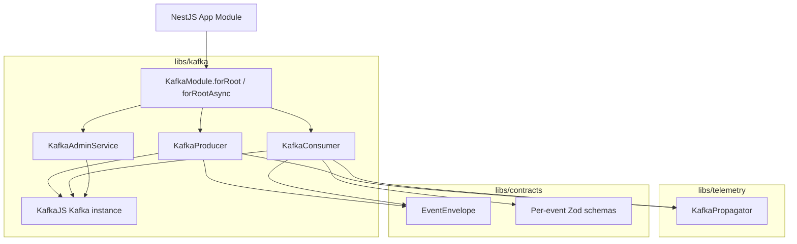

## Overview

`libs/kafka` provides a thin, explicit KafkaJS wrapper exposed as a NestJS dynamic module. It handles producer lifecycle, consumer group management, and the consume loop. No NestJS built-in Kafka transport is used — the wrapper owns keys, headers, offsets, and the consume loop directly.

## Architecture



## Components

### KafkaModule (dynamic)

- Exposes `forRoot(options: KafkaModuleOptions)` and `forRootAsync(asyncOptions)` static methods.
- `KafkaModuleOptions`:
  ```ts
  interface KafkaModuleOptions {
    brokers: string[];
    clientId: string;
    groupId: string;
    ssl?: boolean;
    sasl?: SASLOptions;
  }
  ```
- Creates a single KafkaJS `Kafka` instance shared across `KafkaProducer`, `KafkaConsumer`, and `KafkaAdminService`.
- Implements `OnApplicationBootstrap` to connect the producer and `OnApplicationShutdown` to disconnect all clients gracefully.
- Marks itself `@Global()` so the module only needs to be imported once at the root.

### KafkaProducer

Injectable provider that wraps the KafkaJS producer.

- `publish<T>(topic: string, key: string, envelope: EventEnvelope<T>): Promise<void>`
  1. Injects W3C trace context into the message headers via `KafkaPropagator.inject`.
  2. Serialises `envelope` to JSON.
  3. Calls `producer.send({ topic, messages: [{ key, value, headers }] })`.

### KafkaConsumer

Injectable provider that manages the KafkaJS consumer group.

- `subscribe(topics: string[], handler: MessageHandler): Promise<void>`
  - Subscribes to topics and runs the EachMessage handler.
  - `MessageHandler = (envelope: EventEnvelope<unknown>, ctx: Context) => Promise<void>`

Consume loop per message:
1. Extract W3C trace context from headers via `KafkaPropagator.extract`.
2. Parse JSON value → raw object.
3. Validate against the matching Zod schema from `@concertseats/contracts`.
4. On validation failure: forward to dead-letter topic (`<original-topic>.dlq`); commit offset; continue.
5. Deduplicate by `envelope.eventId` using caller-supplied `isProcessed(eventId): Promise<boolean>` and `markProcessed(eventId): Promise<void>` callbacks. The wrapper does not own storage; the consuming service does.
6. Call `handler` within the extracted trace context.
7. Commit offset after `handler` resolves.

### KafkaAdminService

Injectable provider wrapping the KafkaJS admin client.

- `ensureTopics(topics: { topic: string; numPartitions?: number; replicationFactor?: number }[]): Promise<void>`
  - Creates topics if they do not already exist (idempotent, uses `allowAutoTopicCreation: false` for the Kafka cluster but calls admin API directly).
  - Called during service bootstrap (`OnApplicationBootstrap`).

## Key Design Decisions

| Decision | Rationale |
|---|---|
| `@Global()` module | A single KafkaJS client instance per service process; avoids duplicate connections if multiple feature modules import KafkaModule. |
| Producer connects on bootstrap | Fail fast at startup rather than on first publish. |
| Dead-letter on invalid message, never crash | Aligns with the project convention; a bad message in production must not stop a consumer partition. |
| Deduplication callbacks, not built-in storage | The service owns its Postgres database; providing callbacks keeps `libs/kafka` storage-agnostic. |
| W3C trace propagation at the wrapper layer | Centralises OpenTelemetry concerns; callers get distributed tracing for free without adding telemetry code per handler. |
| Partition key is caller-supplied (`publish` param) | The wrapper does not know domain semantics (e.g. showId keying); callers choose the key per domain conventions. |

## Trade-offs

- **No batch consumer support** — EachMessage loop processes one record at a time for simplicity. Batch processing (EachBatch) can be added later if throughput requires it.
- **Zod schema resolution is caller-provided** — `KafkaConsumer.subscribe` accepts an optional `schemaResolver` callback `(eventType: string) => ZodSchema | undefined`; if none provided, validation is skipped (useful in tests). This is intentionally flexible rather than doing a global registry.
- **Dead-letter routing is fire-and-forget** — the wrapper publishes to the DLQ topic but does not retry DLQ publish failures; an observability alert on DLQ publish errors is assumed to exist at the platform level.
